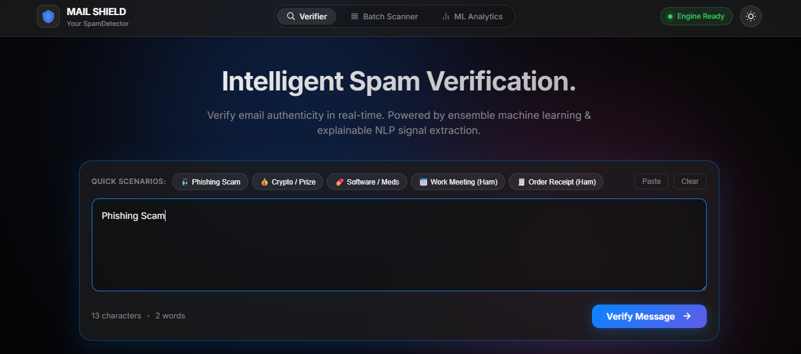
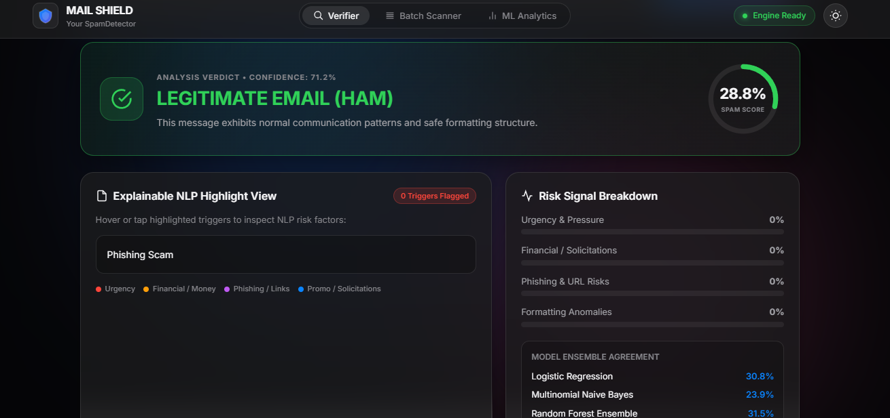
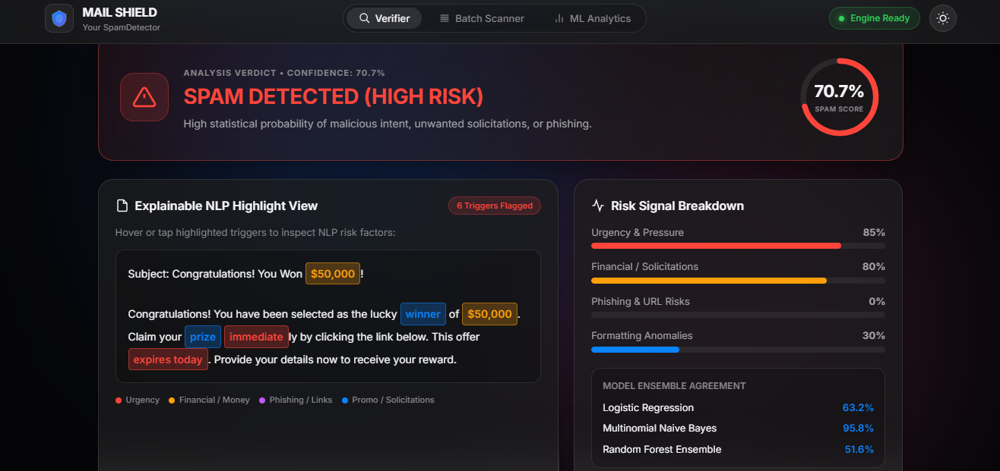

# Mail Shield — NLP-Based Spam Email Detection System

## Overview

Mail Shield is an NLP-based spam email detection system that analyzes email content and classifies messages as spam or legitimate.

## Technologies

- Python
- Natural Language Processing (NLP)
- TF-IDF
- scikit-learn
- Logistic Regression
- Multinomial Naive Bayes
- Random Forest
- Flask
- HTML
- CSS
- JavaScript

## Features

- Real-time email analysis
- Spam probability scoring
- Batch email scanning
- Multiple machine learning models
- Model comparison
- Explainable risk indicators

## Machine Learning Models

The project implements and compares three machine learning classifiers:

- Logistic Regression
- Multinomial Naive Bayes
- Random Forest

## Model Performance

| Model | Accuracy |
|---|---:|
| Logistic Regression | 98.34% |
| Naive Bayes | 98.34% |
| Random Forest | 96.34% |

## Project Structure

```text
Mail-Shield/
├── app.py
├── train_model.py
├── index.html
├── script.js
├── styles.css
├── emails.csv
├── metrics.json
├── model_lr.joblib
├── model_nb.joblib
├── model_rf.joblib
├── vectorizer.joblib
└── requirements.txt

## Screenshots

### Main Application


### Explainable NLP & ML Analysis


### Spam Detection

